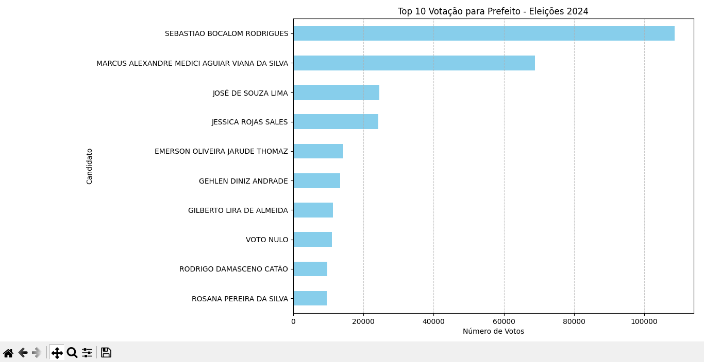
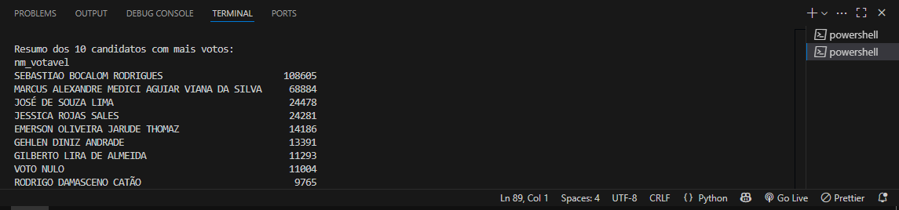

📊 Análise de Dados Eleitorais 2024 – TSE
Este projeto realiza uma análise estatística detalhada dos dados de votação nominal por candidato nas eleições municipais de 2024, utilizando fontes oficiais e abertas do Tribunal Superior Eleitoral (TSE).

🔍 Sobre o Projeto
O sistema automatiza o carregamento, processamento e análise dos arquivos CSV oficiais do TSE, que contêm resultados nominais por município e zona eleitoral. A partir desses dados, é possível:

Analisar o total de votos nominais por partido político.

Gerar visualizações dinâmicas e intuitivas com gráficos de barras para identificar os partidos mais votados.

Explorar e interpretar os dados eleitorais de forma interativa e ágil, utilizando ferramentas avançadas de visualização.

🧰 Tecnologias e Ferramentas Utilizadas
Python 3 — linguagem principal para processamento e análise de dados.

Pandas — biblioteca robusta para manipulação, limpeza e transformação dos dados.

Plotly — ferramenta poderosa para criação de gráficos interativos e visualizações dinâmicas.

Dados Abertos do TSE — fonte oficial, garantindo transparência e confiabilidade dos dados eleitorais.

---

## ▶️ Como Executar

1. Clone ou baixe este repositório.

2. Instale as dependências:

pip install pandas plotly

3. Execute o script:

python app.py

Quando solicitado no terminal, informe:

O caminho da pasta onde está o CSV extraído.

A sigla do estado desejado (exemplo: SP, RJ, MG) ou enter para aparecer o geral.

---

📸 Visualizações do Projeto
 📈 **Gráfico 1 – Partidos mais votados**    📉 **Gráfico 2 – Votação total por partido**
🔍 Clique nas imagens para vê-las em tamanho maior.

## 📂 Fonte dos Dados

Os dados utilizados foram baixados do portal de dados abertos do TSE:

📎 [Votação nominal por município e zona - 2024 (ZIP)](https://cdn.tse.jus.br/estatistica/sead/odsele/votacao_candidato_munzona/votacao_candidato_munzona_2024.zip)

> Dentro do arquivo ZIP, selecione o CSV correspondente ao estado desejado, como `votacao_candidato_munzona_2024_SP.csv`.

---

👨‍💻 Desenvolvido por
Eduardo Martins
🔗 GitHub - https://github.com/Eduuh007
🔗 LinkedIn - https://www.linkedin.com/in/eduardo-martins-575521245

#Eleições2024 #AnáliseDeDados #Python #Pandas #Plotly #EstatísticasEleitorais #TSE #VotosPorPartido #CiênciaDeDados 

